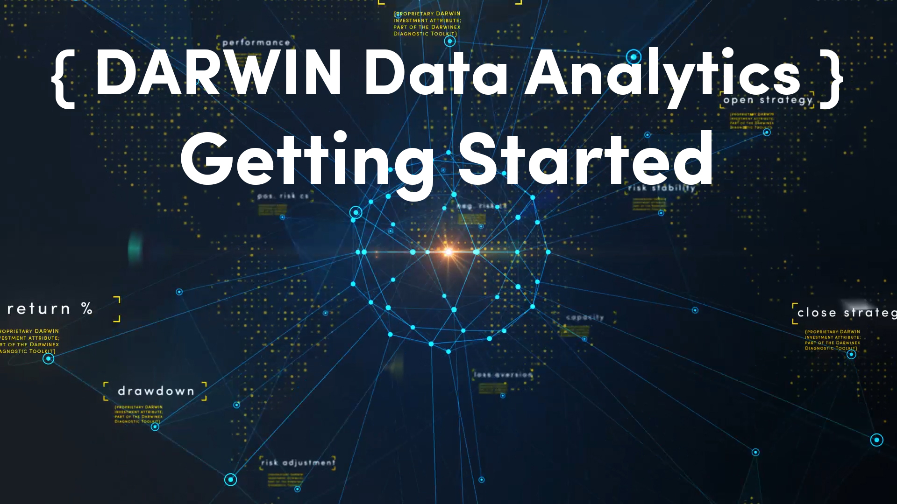

## DARWIN Data Analytics for Algorithmic Trading

### Prerequisites
1. Python **v3.6+**
1. FTP access to the raw DARWIN data repository. To request it, please visit: https://www.darwinex.com/data/darwin-data
1. Once obtained, please place your credentials inside `CONFIG/your-chosen-filename.cfg` where the contents of the file should be:
```
username=<YOUR-DARWINEX-USERNAME>
password=<YOUR-DARWIN-DATA-FTP-PASSWORD>
server=darwindata.darwinex.com
port=21
```

This filepath must then be passed to the `__init__` function of the class:

`def __init__(self, config='CONFIG/your-chosen-filename.cfg')`

### Python module requirements
1. os
1. io
1. pandas
1. ftplib
1. matplotlib

### Example Usage & Tutorials
**[Click here to watch the dedicated YouTube Playlist](https://www.youtube.com/playlist?list=PLv-cA-4O3y971GdF958WoidF3HISpAiTf)**


